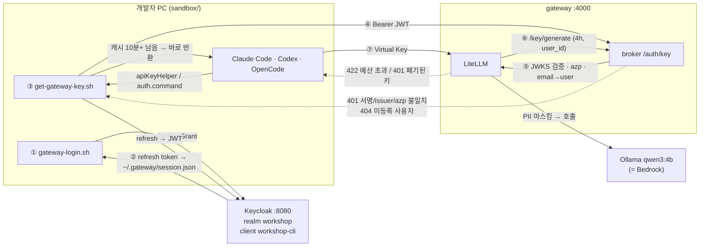

# LLM Gateway 워크샵 — 로컬 재현 키트

AWS 워크샵 「AI Coding Assistant(Claude Code/Codex/OpenCode) 제공을 위한 LLM Gateway 구축」을 로컬 Docker로 재현한다. LiteLLM 엔터프라이즈 JWT 인증 없이, **Keycloak SSO와 Key Vending Broker로 임시 Virtual Key를 자동 발급**하는 구조가 핵심이다.

## 원본 워크샵

| 항목 | 내용 |
| --- | --- |
| 제목 | AI Coding Assistant(Claude Code/Codex/OpenCode) 제공을 위한 LLM Gateway 구축 |
| 주최 | AWS (이벤트용 임시 계정, 참가자 비용 없음) |
| 대상 | 기업의 클라우드·플랫폼·보안 담당자 |
| 소요 | 약 4시간 |
| 리전 | us-east-1 (Bedrock Runtime 글로벌 엔드포인트를 제공하는 리전이면 같은 구성 가능) |
| 사용 서비스 | Bedrock, EC2, RDS(Aurora), CloudFront, PrivateLink, IAM, Secrets Manager, CloudTrail |
| 실습 도구 | LiteLLM AI Gateway(오픈소스 무료 버전), Keycloak |

**풀려는 문제.** 개발자들이 AI 코딩 툴을 각자 개인 API 키와 결제 수단으로 쓰기 시작하면 운영 측에는 세 가지가 보이지 않는다.

- **신원**: 누가 쓰는가
- **비용**: 얼마나 쓰는가
- **감사**: 어떤 코드와 프롬프트가 밖으로 나갔는가

툴을 금지하면 생산성을 잃고, 방치하면 Shadow IT가 된다. 워크샵의 답은 개발자가 쓰던 툴은 그대로 두고, **모든 모델 호출이 반드시 지나가는 단일 진입점(LLM Gateway)** 을 세워 그 위에 인증·예산·로깅·정책을 거는 것이다.

**목표는 LiteLLM 사용법이 아니다.** 상용 제품이든 오픈소스든, 금융·엔터프라이즈라면 결국 LLM Gateway를 직접 구축해야 한다. 그래서 게이트웨이를 직접 구성하고 모델·사용자·예산·인증·모니터링을 운영해 보는 경험이 목표다. 여기서 정한 기준과 순서는 솔루션을 바꿔도 거의 그대로 적용된다. 참가자는 **LLM Gateway 운영자** 역할로, 개발자 페르소나(developer001, developer002)를 온보딩한다.

**핵심 아이디어: Key Vending Broker.** LiteLLM을 비롯한 게이트웨이 솔루션은 자체 JWT/SSO 인증을 대부분 엔터프라이즈 유료 구독에서만 제공한다. 워크샵은 무료 기능만으로 이를 대신 구현한다.

- 개발자가 Keycloak SSO로 로그인하면, broker가 JWT를 검증하고 LiteLLM의 무료 API(`/key/generate`)로 **임시 Virtual Key**를 발급한다.
- 정적 API Key는 쓰지 않는다.

| 모듈 | 내용 | 이 키트에서 |
| --- | --- | --- |
| 1. 기본 인프라 탐색 | VPC 서브넷·라우팅 테이블, VPC 엔드포인트 3개의 정책을 콘솔에서 확인 | 재현 안 함 (README 참고 설명) |
| 2. LLM Gateway 구축 | LiteLLM 컨테이너 배포, Admin UI에서 모델 등록·API 포맷 검증, 사용자 등록·예산 설정 | `docker-compose.yml`, `litellm/`, `admin/onboard-users.sh` |
| 3. Keycloak SSO로 임시 API Key 발급 | Device Grant 로그인, broker 기반 임시 키 자동 발급 | `keycloak/`, `broker/`, `client/bin/` |
| 4. AI 코딩 툴 연결 | Claude Code·Codex·OpenCode 연결 (4-2 Claude Desktop 선택, 4-5 우회 차단 계층 참고) | `client/templates/`, `client/dev-shell.sh` |
| 5. 모니터링과 감사 | 지출·프롬프트 로그 감사, 예산 초과 422·키 폐기, PII 마스킹·Guardrails (5-4 OTel→CloudWatch 참고) | `admin/audit-spend.sh`, `revoke-keys.sh`, `block-user.sh`, `litellm/pii_filter.py` |
| Cleanup / 랩업 | 산출물(설정 파일) 다운로드, 프로덕션 구축 방안 | 이 레포가 산출물 |

**원본 아키텍처 (참가자 계정당).** 참가자 → CloudFront → code-server(VSCode, Claude Code/Codex/OpenCode) / Keycloak / LiteLLM(EC2) → Aurora RDS. LiteLLM은 Bedrock VPC 엔드포인트로 Bedrock을 호출한다.

- 모델 호출 구간은 인터넷을 거치지 않는다. Claude·GPT-5.6 Sol·Qwen은 `bedrock-runtime` 엔드포인트, 선택 실습의 GPT-OSS는 `bedrock-mantle` 엔드포인트를 쓰며 모두 PrivateLink 프라이빗 경로다.
- 환경 접근(code-server·Keycloak·LiteLLM)은 실습 편의상 CloudFront 퍼블릭 경로다. 프로덕션에서는 전용선이나 VPN을 쓴 프라이빗 구성을 권장한다.

## 빠른 시작

```bash
cp .env.example .env
ollama pull qwen3:4b                 # Bedrock 대신 쓸 로컬 모델
docker compose up -d --build         # postgres · keycloak · litellm · broker · gateway
admin/onboard-users.sh               # [운영자] developer001/002 등록 + 예산
client/install.sh                    # [개발자 PC] sandbox/ 에 헬퍼·툴 설정 배치
client/dev-shell.sh                  # 개발자 PC로 들어가기 (HOME=sandbox)
  gateway-login.sh                   #   브라우저에서 developer001 / Workshop123! 로그인
  claude                             #   게이트웨이 경유 Claude Code
tests/e2e.sh                         # 전체 시나리오 자동 검증 (약 40초)
```

## 워크샵과 다른 점

| 워크샵 (AWS) | 로컬 재현 | 이유 |
| --- | --- | --- |
| Amazon Bedrock (PrivateLink) | 호스트 Ollama `qwen3:4b` | Bedrock 호출 불가 환경. 모델 이름(`claude-sonnet-5` 등)은 그대로 두고 백엔드만 바꿨다 |
| CloudFront (경로 분기) | `gateway` nginx `:4000` | `/auth/*` → broker, 나머지 → LiteLLM |
| Aurora RDS | `postgres` 컨테이너 | |
| code-server EC2 (`/home/ec2-user`) | `sandbox/` + `client/dev-shell.sh` | 실제 `~/.claude`·`~/.codex`와 섞이지 않게 HOME을 바꿔 실행 |
| `/etc/profile.d/workshop.sh` | `sandbox/workshop.env` | 헬퍼 스크립트가 읽는 URL. `client/install.sh`가 `.env`에서 생성 |
| VPC·IAM·VPC 엔드포인트 정책 (모듈 1, 4-5) | 재현하지 않음 | 콘솔 탐색·참고 읽기 모듈. 아래 [우회 차단 계층](#우회-차단-계층-모듈-4-5-참고) 참고 |

로컬 모델은 비용이 0이라서 `litellm/config.yaml`에 **LiteLLM 내장 가격표의 Bedrock 단가**를 그대로 넣었다. 예산·지출 실습이 실제와 같은 비율로 동작한다.

## 큰 그림



- **정적 키가 없다** — 개발자 PC에 남는 건 길어야 4시간짜리 Virtual Key. 장기 자격증명은 Keycloak refresh token이고 IdP 정책(세션 만료·계정 비활성화)이 통제한다.
- **키는 user_id에만 묶는다** — `team_id`를 붙이면 team 예산이 우선해 사용자별 예산을 우회한다.
- **LiteLLM에 등록된 사람만 키를 받는다** — SSO에 성공해도 broker가 email로 LiteLLM 사용자를 못 찾으면 404. 온보딩이 곧 승인 절차다.
- **master key는 broker와 운영자만 안다** — 개발자 PC(`sandbox/workshop.env`)에는 공개 URL만 내려간다.

## 폴더 구조

```
workshop/
├── .env.example              정책값 SSOT: URL·비밀값·키 수명·사용자 예산 기본값
├── docker-compose.yml        서버 5개. 외부 포트는 gateway(4000)·keycloak(8080)뿐
├── gateway/nginx.conf        CloudFront 역할
├── keycloak/realm-workshop.json   realm · workshop-cli(device grant) · developer001/002
├── litellm/
│   ├── config.yaml           모델 4개 + 단가, PII 가드레일, 프롬프트 로깅
│   └── pii_filter.py         커스텀 가드레일 (주민번호·휴대폰 마스킹)
├── broker/app.py             JWT 검증 → Virtual Key 발급
├── client/                   ── 개발자 PC 쪽 ──
│   ├── bin/gateway-login.sh      SSO 로그인 (Device Grant)
│   ├── bin/get-gateway-key.sh    키 헬퍼 (stdout에 키만 출력)
│   ├── templates/                Claude Code · Codex · OpenCode 설정
│   ├── install.sh                sandbox/ 에 배치
│   └── dev-shell.sh              HOME=sandbox 로 셸/명령 실행
├── admin/                    ── 운영자 쪽 (master key 사용) ──
│   ├── onboard-users.sh          사용자 등록·예산·RPM (모듈 2-3, 5-2 예산 조정)
│   ├── audit-spend.sh            예산 현황 · 요청별 프롬프트/비용 (모듈 5-1)
│   ├── revoke-keys.sh            키 폐기 (모듈 5-2)
│   └── block-user.sh             완전 차단: Keycloak 비활성화 + 키 폐기 (모듈 5-2)
├── tests/
│   ├── e2e.sh                    모듈 2~5 시나리오 테스트 (developer002)
│   └── lib/approve-device.sh     브라우저 없이 device 로그인 승인
└── sandbox/                  (gitignore) 개발자의 $HOME. install.sh가 만든다
```

## 실습 진행

### 0. 준비

- Docker Desktop, `jq`, `curl`, Ollama
- `ollama pull qwen3:4b` — tool calling을 지원해야 Claude Code·Codex가 동작한다(`llama3`는 tools 미지원으로 실패).
- `cp .env.example .env && docker compose up -d --build`
- 확인: `curl localhost:4000/auth/health` → `{"status":"ok", ...}`

| 화면 | URL | 계정 |
| --- | --- | --- |
| LiteLLM Admin UI | http://localhost:4000/ui | `admin` / `.env`의 `LITELLM_MASTER_KEY` |
| Keycloak Admin | http://localhost:8080/admin | `admin` / `.env`의 `KEYCLOAK_ADMIN_PASSWORD` |
| 개발자 계정 | (device 로그인 화면) | `developer001`, `developer002` / `Workshop123!` |

### 모듈 2 — LLM Gateway 구축

모델은 `litellm/config.yaml`에 선언돼 있어 기동과 동시에 등록된다. Admin UI의 Models 탭에서 4개를 확인한다. UI에서 추가한 모델도 DB에 저장된다(`STORE_MODEL_IN_DB`).

**API 포맷 검증** — 같은 게이트웨이가 세 가지 포맷을 받는다.

```bash
set -a; . ./.env; set +a
# Anthropic Messages (Claude Code)
curl -s $GATEWAY_URL/v1/messages -H "x-api-key: $LITELLM_MASTER_KEY" -H 'anthropic-version: 2023-06-01' \
  -H 'content-type: application/json' -d '{"model":"claude-sonnet-5","max_tokens":512,"messages":[{"role":"user","content":"hi"}]}' | jq .content
# OpenAI Responses (Codex)
curl -s $GATEWAY_URL/v1/responses -H "Authorization: Bearer $LITELLM_MASTER_KEY" \
  -H 'content-type: application/json' -d '{"model":"gpt-5.6-sol","input":"hi"}' | jq .output
# OpenAI Chat Completions (OpenCode)
curl -s $GATEWAY_URL/v1/chat/completions -H "Authorization: Bearer $LITELLM_MASTER_KEY" \
  -H 'content-type: application/json' -d '{"model":"qwen3-coder","messages":[{"role":"user","content":"hi"}]}' | jq .choices
```

**사용자 등록 + 예산 (2-3)**

```bash
admin/onboard-users.sh                                   # developer001/002, $5/30d, 30 RPM
admin/onboard-users.sh developer003@example.com 10 60    # 한 명, 예산·RPM 지정
```

- `auto_create_key: false`로 등록한다. LiteLLM `/user/new`는 기본으로 **만료 없는 키를 자동 생성**해서, 정적 키를 없앤다는 설계에 어긋난다.
- 재실행하면 정책만 갱신한다.

### 모듈 3 — Keycloak SSO로 임시 API Key 발급

```bash
client/install.sh
client/dev-shell.sh                 # 프롬프트가 [dev-sandbox] 로 바뀐다
gateway-login.sh                    # 브라우저가 열리면 developer001 로그인 → "Yes"(동의)
get-gateway-key.sh                  # sk-... 출력
cat ~/.gateway/virtual-key.json | jq 'del(.key)'   # expires_at, user_email, duration
get-gateway-key.sh                  # 같은 키 (캐시 10분 이상 남음 → 새로 발급 안 함)
```

- Device Grant는 Keycloak 설정상 `consentRequired=false`여도 **항상 동의 화면을 띄운다**. "Yes"를 눌러야 완료된다.
- Admin UI → Virtual Keys에서 `sso-developer001-MMDD-HHMMSS-xxxx` alias로 발급 내역을 확인한다.
- broker 거절 경로를 직접 확인할 수 있다.
  ```bash
  curl -s -XPOST localhost:4000/auth/key                                  # 401 header required
  curl -s -XPOST localhost:4000/auth/key -H 'Authorization: Bearer x'     # 401 JWT validation failed
  ```

### 모듈 4 — AI 코딩 툴 연결

`client/dev-shell.sh` 안에서 실행한다. 설정 원본은 `client/templates/`.

| 툴 | 설정 파일 (sandbox 기준) | 키 전달 방식 | 게이트웨이 경로 |
| --- | --- | --- | --- |
| Claude Code | `~/.claude/settings.json` | `apiKeyHelper` → 헬퍼 실행 | `/v1/messages` |
| Codex | `~/.codex/config.toml` | `[model_providers.litellm.auth] command` | `/v1/responses` |
| OpenCode | `~/.config/opencode/opencode.json` | `{file:~/.gateway/virtual-key}` 평문 파일 참조 | `/v1/chat/completions` |

```bash
claude -p "hello"                                    # 또는 그냥 claude (대화형)
codex exec --skip-git-repo-check "hello"
get-gateway-key.sh >/dev/null && opencode            # OpenCode는 헬퍼를 직접 부르지 않는다 → 먼저 키 파일 갱신
```

- `dev-shell.sh`는 `ANTHROPIC_API_KEY`·`OPENAI_API_KEY`를 지운다. 게이트웨이를 우회하는 자격증명이 남지 않게 하기 위해서다.
- 로컬 4B 모델이라 Claude Code의 긴 시스템 프롬프트·도구 지시를 잘 따르지 못한다. **실습 목적은 경로·인증·통제 검증**이고, 품질은 Bedrock으로 바꾸면 해결된다.
- 검증 상태: Claude Code 2.1.285, Codex 0.155.1에서 확인했다. OpenCode는 설치하지 않아 **미검증**이다.

### 모듈 5 — 모니터링과 감사

**5-1 지출·프롬프트 감사**

```bash
admin/audit-spend.sh                                  # 사용자별 SPEND / BUDGET / USED%
admin/audit-spend.sh developer001@example.com 10      # 최근 10건: 시각·키 alias·모델·call_type·비용·프롬프트
```

- `store_prompts_in_spend_logs: true`로 프롬프트 원문이 `proxy_server_request`에 남는다.
- 지출 로그는 비동기로 기록된다. 방금 보낸 요청은 수십 초 뒤에 보인다.

**5-2 예산 초과 → 422, 키 폐기, 완전 차단**

```bash
admin/onboard-users.sh developer001@example.com 0.01   # 예산을 현재 지출보다 낮춘다
# [dev-sandbox] claude -p hi  →  API Error: 422 ExceededBudget: ... over budget. Spend=..., Budget=0.01
admin/onboard-users.sh developer001@example.com        # 기본 예산으로 복구

admin/revoke-keys.sh developer001@example.com          # 키 폐기 → 다음 호출 401
admin/block-user.sh developer001                       # Keycloak 비활성화 + 세션 종료 + 키 폐기
admin/block-user.sh developer001 --unblock             # 해제 (개발자는 gateway-login.sh부터 다시)
```

| 조치 | 기존 키 | 새 키 발급 | 용도 |
| --- | --- | --- | --- |
| `revoke-keys.sh` | 401 | 가능 (SSO 세션 유효) | 키 유출 대응, 강제 교체 |
| `block-user.sh` | 401 | 불가 (`SSO session expired`) | 퇴사·권한 회수 |
| Keycloak 비활성화만 | **최대 4시간 유효** | 불가 | 단독으로는 부족 |

**5-3 PII 마스킹 (커스텀 가드레일)**

```bash
# [dev-sandbox]
K=$(get-gateway-key.sh)
curl -s $GATEWAY_URL/v1/chat/completions -H "Authorization: Bearer $K" -H 'content-type: application/json' \
  -d '{"model":"qwen3-coder","messages":[{"role":"user","content":"그대로 따라 써: 주민번호 900101-1234567, 연락처 010-1234-5678"}]}' \
  | jq -r '.choices[0].message.content' | tail -1
# → 주민번호 [KR-RESIDENT-ID], 연락처 [KR-MOBILE]
```

- `pre_call` 훅이라 모델에 가기 전에 바뀐다. 감사 로그에도 **마스킹된 값만 남는다**(e2e에서 검증).
- 패턴을 추가하려면 `litellm/pii_filter.py`의 `PII_PATTERNS`에 넣고 `docker compose restart litellm`.
- Bedrock Guardrails·Presidio는 이 키트 범위 밖이다.

## 시나리오 테스트

```bash
tests/e2e.sh
```

developer002로 아래를 순서대로 검증한다. 개발자 PC는 임시 디렉터리에 새로 깔아서 `sandbox/`는 건드리지 않고, 끝나면 예산·차단 상태를 원복한다.

① 스택 상태 → ② broker 거절(토큰 없음·위조·다른 realm) → ③ Device Grant 로그인 → ④ 미등록 사용자 404 → 온보딩 → 키 발급·캐시·권한 600·정적 키 없음 → ⑤ 세 API 포맷 → ⑥ PII 마스킹·감사 로그·지출 집계 → ⑦ 예산 초과 422 → ⑧ 키 폐기 401·재발급 → ⑨ 완전 차단

## 알려진 한계 (원본 스크립트 그대로 재현)

- **폐기된 키를 헬퍼가 계속 돌려준다** — `get-gateway-key.sh`는 캐시의 만료 시각만 보고 유효성은 확인하지 않는다. `revoke-keys.sh` 후에도 캐시가 10분 이상 남아 있으면 같은 키를 반환해 401이 반복된다. 개발자가 `rm ~/.gateway/virtual-key.json` 하면 새 키를 받는다. e2e ⑧에서 이 동작을 고정해 두었다.
- **refresh token 경합** — Claude Code와 Codex가 동시에 캐시 만료를 만나 헬퍼를 부르면 같은 refresh token을 두 번 쓴다. Keycloak에서 Revoke Refresh Token을 켜면 한쪽이 재로그인을 요구받는다(기본값 off).
- **키 누적** — 약 3시간 50분마다 새 키를 발급하고 이전 키는 만료를 기다린다. LiteLLM DB에 키가 쌓인다.
- **audience 미검증** — broker는 `verify_aud=False`이고 `azp` 확인에 의존한다. 프로덕션에서는 전용 audience mapper를 추가해 `aud`도 검증한다.

## Bedrock으로 전환

`litellm/config.yaml`에서 각 모델의 `model`을 바꾸고 `api_base`·`input/output_cost_per_token` 줄을 지운다(내장 가격표가 적용된다). LiteLLM 컨테이너에는 Bedrock 호출 권한이 있는 AWS 자격증명과 `AWS_REGION_NAME`을 넣는다.

| model_name | model (LiteLLM 1.104.0 가격표 기준) |
| --- | --- |
| `claude-sonnet-5` | `bedrock/global.anthropic.claude-sonnet-5` |
| `claude-haiku-4-5` | `bedrock/global.anthropic.claude-haiku-4-5-20251001-v1:0` |
| `gpt-5.6-sol` | `bedrock/global.openai.gpt-5.6-sol` |
| `qwen3-coder` | `bedrock/qwen.qwen3-coder-next` |

이 표의 ID는 가격표에서 가져온 것이고 Bedrock 호출로는 **검증하지 못했다**. 계정에서 활성화된 모델·리전을 `aws bedrock list-inference-profiles`로 확인한다.

## 우회 차단 계층 (모듈 4-5 참고)

게이트웨이를 만들어도 개발자가 Bedrock·Anthropic API를 직접 부를 수 있으면 통제가 무력해진다. 워크샵은 세 계층으로 막는다.

- **자격증명** — 개발자 환경에 모델 제공자 키·AWS 자격증명을 두지 않는다. 이 키트에서는 `dev-shell.sh`가 관련 환경변수를 지운다.
- **IAM** — `bedrock:InvokeModel*` 권한은 게이트웨이 실행 역할에만 준다. 개발자 역할에는 명시적 Deny를 둔다.
- **네트워크** — Bedrock VPC 엔드포인트 정책의 Principal을 게이트웨이 역할로 제한하고, 개발자 서브넷에서 외부 AI API로 나가는 egress를 막는다.

## 뭘 바꾸려면 어디를 보나

| 바꾸려는 것 | 위치 |
| --- | --- |
| 키 수명 | `.env` `KEY_DURATION` → `docker compose up -d broker` |
| 기본 예산·RPM | `.env` `USER_*` → `admin/onboard-users.sh` |
| 모델 추가·백엔드 교체 | `litellm/config.yaml` → `docker compose restart litellm` |
| PII 패턴 | `litellm/pii_filter.py` |
| 개발자 계정 | `keycloak/realm-workshop.json` (첫 기동 때만 import. 이후엔 Admin 콘솔) |
| 키 발급 규칙 (검증·alias·metadata) | `broker/app.py` → `docker compose up -d --build broker` |
| 툴 설정 | `client/templates/` → `client/install.sh` |
| 포트·URL | `.env` `*_PORT`, `*_URL` (둘을 같이 바꾼다) |

## 정리

```bash
docker compose down -v      # 컨테이너 + DB 볼륨 삭제 (Keycloak은 start-dev라 컨테이너와 함께 초기화)
rm -rf sandbox
```
